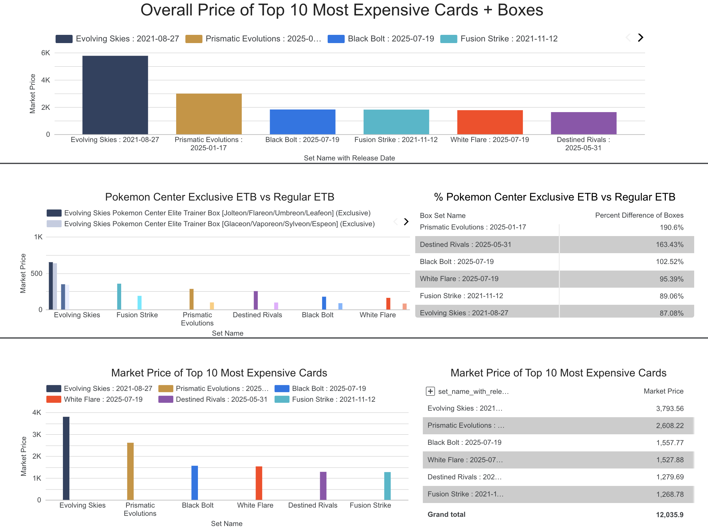
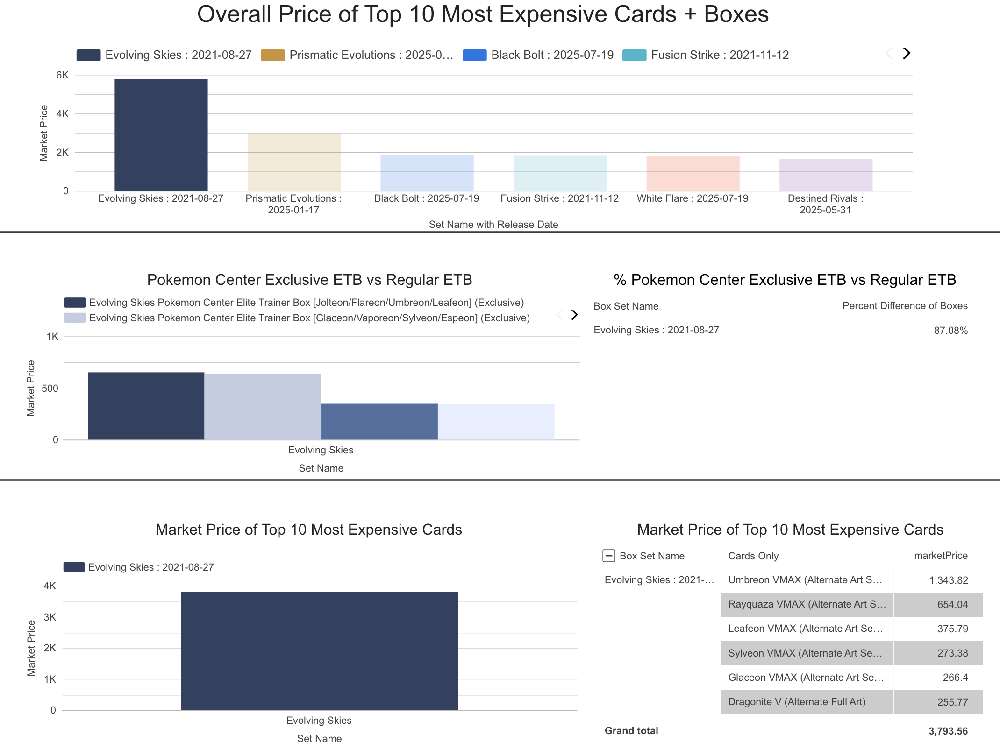
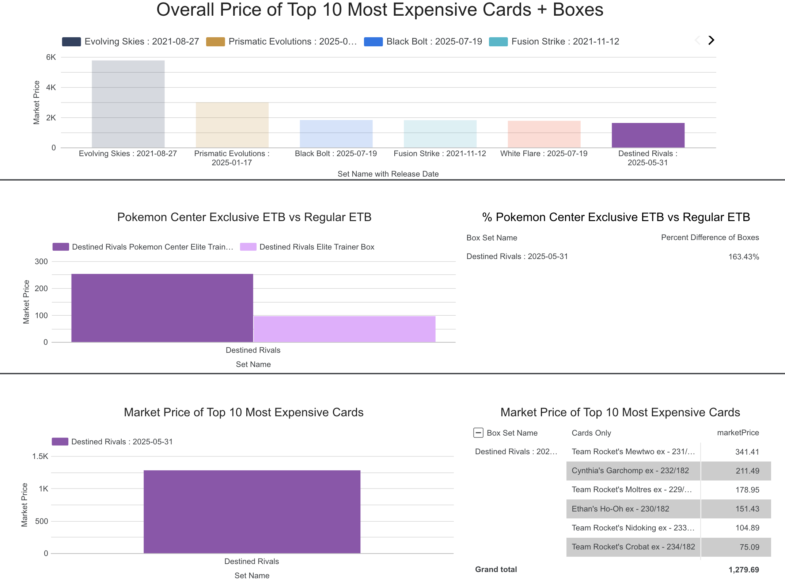

# Pokemon-Sets-Price-Analysis
A data analysis project to identify the primary factors of Elite Trainer Box price inflation across six Pokemon TCG sets, leveraging SQL and a dashboard for visualization.
[Click here to view the interactive dashboard!](https://lookerstudio.google.com/reporting/77fdd296-43fe-4d75-9e88-391607f9999c/page/URIVF)

## Project Overview

In this project, I used raw CSV files from TCGPlayer (marketplace for Trading Cards) to uncover insights from different Pokemon sets. The pipeline uses SQL (Google BigQuery) for data cleaning and extracting valuable data while Google Looker studio is used to create an interactive dashboard. 

The primary objective was to analyze market trends and discover answers to the following key questions:

How does the price of a Pokemon Center Exclusive Elite Trainer Box compare to a regular Elite Trainer Box?

What contributes to the overall market price of certain set boxes? Specifically - which cards from each set have the highest market price that lead to the boxes inflated value?

## Overall Key Findings

Market Value: The Evolving Skies set demonstrates the higest overall market value among the six sets analyzed in terms of both Elite Trainer Box value and Top 10 most expensive cards in the set. 

Card vs. Box Value: The dashboard highlights a significant trend in the market for Pokemon Center Exclusive Elite Trainer Boxes. These exlcusive proucts consistently show a much higher market price compared to their regular ETB counterparts. This finding suggests that there is a strong collector demand for these exclusive boxes. The only difference between the regular boxes and Pokemon Center version is a promo card (market price of the promo often does not offset the difference) and packaging. The picture above illustrates how the "Prismatic Evolutions" set has a 190.6% price difference between the two box types. 

## Top Card Performance and Box Release

The list of the Top 10 Most Expensive Cards reveals that sets with expensive cards are the primary drivers of the overall set prices. While the Fusion Strike boxes have the 2nd highest market than the rest, this is primarily due to the print life of the set. It came out in 2021 and Pokemon is fully done producing these boxes, driving the box price higher but not the overall set price and top 10 card prices.

### Most Expensive Set - A Deeper Dive into "Evolving Skies"

As the "Overall Price of Top 10 Most Expensive Cards + Boxes" chart demonstrates, the Evolving Skies set holds a significantly higher market price than any other set in this analysis. This isn't just because it has a high number of valuable cards; it is heavily influenced by a few extremely valuable "chase cards."

A closer look reveals that the Evolving Skies set is home to some of the most sought-after cards in the Pokémon TCG, including:

Umbreon VMAX (Alternate Art Secret) - The most valuable card in the data. With a market price of $1,343.82 - it exceeds all other cards by a large margin.

Rayquaza VMAX (Alternate Art Secret) - $654.04

Sylveon VMAX (Alternate Art Secret) - $375.79

These high-value cards, often featuring unique or full art designs, contribute disproportionately to the set's overall market price, making it a key finding for collectors and investors.

### The Least Valuable Set - A Deeper Dive into "Destined Rivals"

While some sets are highly valued for their expensive chase cards, the analysis reveals that Destined Rivals has the lowest overall market price of all the sets examined. This is an important finding because it highlights the impact of market dynamics beyond just product rarity. 

Team Rocket's Mewtwo - The most valuable card in the data, with a pricetag of $341.41

Cynthia's Garchomp - $211.49

Ethan's Ho-Oh ex - $178.95

The low market value of this set suggests it does not contain the same type of highly sought-after, expensive cards that drive up the overall price of sets like Evolving Skies. This makes Destined Rivals a great set for collectors on a budget, as it provides a much more accessible entry point to collecting without the pressure of chasing ultra-rare, high-value cards. Even though the set has the second highest percent difference between both Elite Trainer Boxes, the cards in each set act as an important catalyst of the overall sets.

